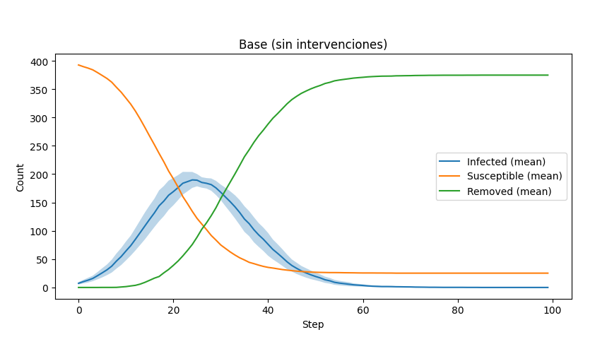

# AgentesMesa
Comportamiento de un virus basado en agentes, hecho con Mesa en Python

## 🤖 Cómo ejecutar la Simulación

### Requisitos
- Python 3.8+

### Ejecución
```bash
pip install -r requirements.txt
```
```bash
python main.py
```

## Análisis de resultados



En el escenario **base (sin intervenciones)** se observa un comportamiento típico de propagación epidémica: los contagios crecen rápidamente hasta alcanzar un pico alto alrededor de la mitad de la simulación. Los individuos susceptibles caen de forma abrupta y la mayoría de la población termina en la categoría de removidos (recuperados o fallecidos). Este escenario refleja lo que ocurre cuando no se aplican medidas de control: el virus se propaga sin obstáculos y afecta a gran parte de la población en poco tiempo.  
