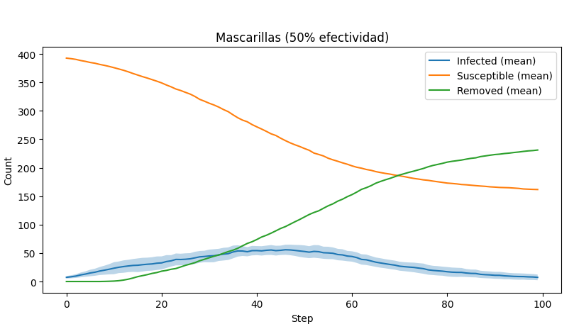
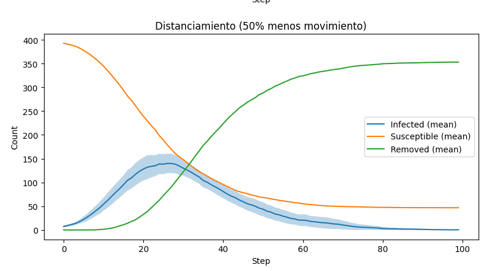
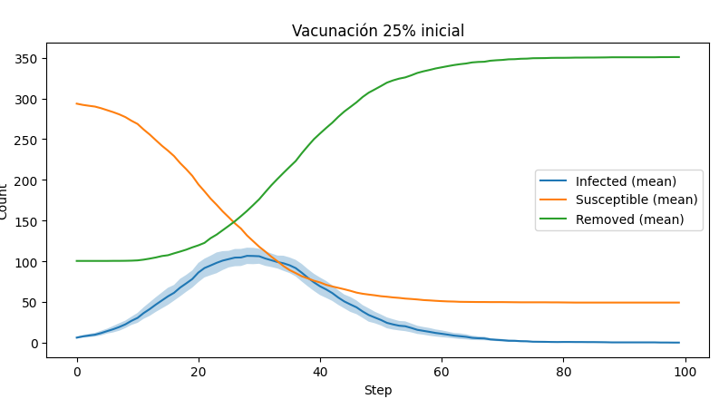
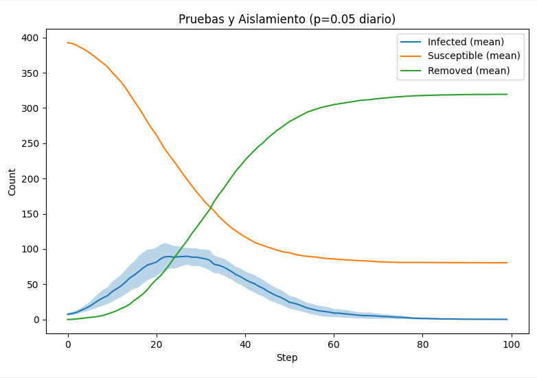
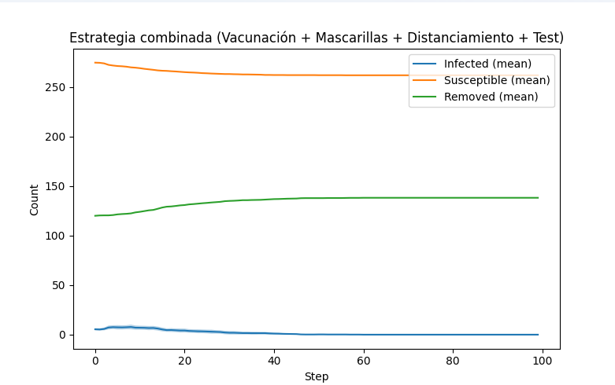

# AgentesMesa
Comportamiento de un virus basado en agentes, hecho con Mesa en Python

## 🤖 Cómo ejecutar la Simulación

### Requisitos
- Python 3.8+

### Ejecución
```bash
pip install -r requirements.txt
```
```bash
python main.py
```

## 📊 Análisis de resultados

### Caso base: 


En este escenario base, sin la implementación de medidas de control, la dinámica de la epidemia sigue una curva de propagación exponencial. Se observa un rápido crecimiento de la incidencia, alcanzando un pico elevado en la mitad del periodo de simulación. La población susceptible disminuye abruptamente, mientras que la mayoría de los individuos transitan hacia el estado de removidos. Este patrón de comportamiento refleja la propagación de un agente infeccioso sin restricciones.

### Estrategia: Mascarillas.


Con la implementación de **mascarillas con un 50% de efectividad**, la estrategia demuestra un aplanamiento de la curva epidémica.+ Es decir, existe una reducción del pico de contagios y una desaceleración en la velocidad de propagación. Se alivia la presión sobre los sistemas de salud y se evita su saturación.  

### Estrategia: Distanciamiento.



El **distanciamiento social** reduce el movimiento en un 50%, lo que disminuye la velocidad de transmisión del virus. La curva de contagios es más baja que en el escenario base. Aunque el número de casos sigue siendo considerable, el efecto principal es retrasar y distribuir los contagios a lo largo de un período de tiempo más prolongado. 

### Estrategia: Vacunación. 



Con la **vacunación inicial del 25% de la población**, se observa un impacto directo desde el inicio, ya que se reduce la cantidad de individuos susceptibles. Esto disminuye el alcance del brote, y el número de infectados alcanza un pico mucho más bajo. La epidemia se controla en menos tiempo.

### Estrategia: Pruebas y Aislamiento.



La estrategia de **pruebas y aislamiento**, con una probabilidad diaria de 0.05, permite detectar a los individuos infectados y aislarlos. Lo que produce una curva de contagios más controlada que en el escenario base. Sin embargo, su efectividad es menor en comparación con las estrategias de vacunación o el uso masivo de mascarillas.

### Estrategias Combinadas.



Finalmente, la **estrategia combinada**, que integra vacunación, mascarillas, distanciamiento y testeo, demuestra ser la más efectiva. Los contagios se mantienen en niveles mínimos durante toda la simulación, y la propagación queda prácticamente contenida.

## Integrantes del grupo

- Laura González
- Camilo Madero    
- Paula Páez
